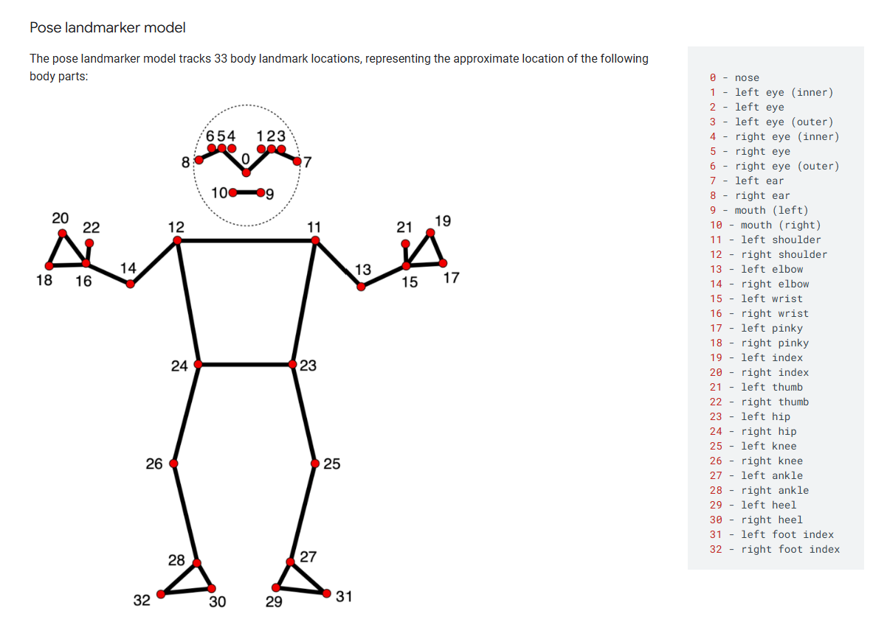
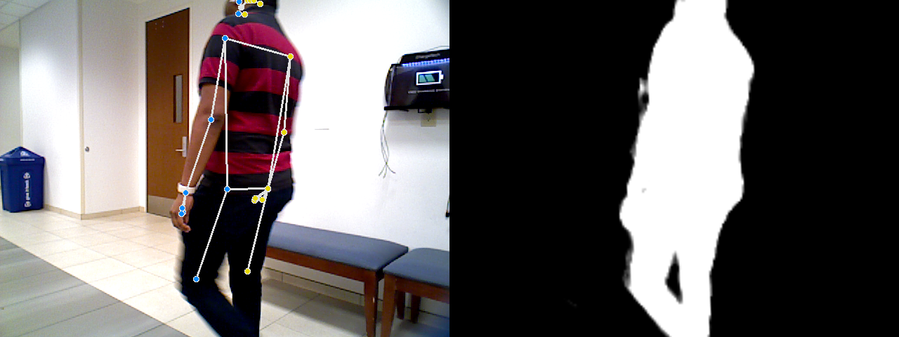
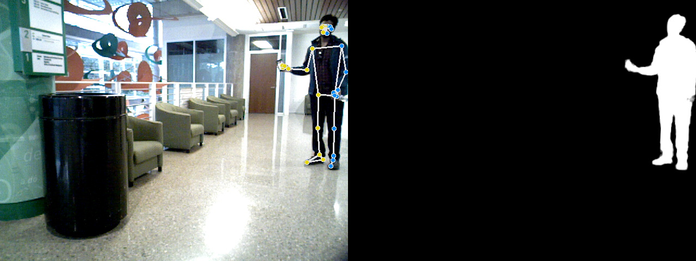

# HumanPoseHandBoxes

# Installation
1. Clone the repo
```
git clone https://github.com/IRVLUTD/HumanPoseHandBoxes.git
```
2.Setting up MediaPipe
```
pip install mediapipe
```
# Running on Images
* Go to the main file.
* Place the desired image in the Images folder
* Swap out the imageFilePath variable with a relative path to the desired image
* Run the main file cv2 will output the image with bounding boxes to your screen. This image will also be saved in the OutputImages folder under *imageName_boxed.
* The output image should contain the original image with bounding boxes on the hands if visible and zoomed in images which are crops of the bounding boxes around the hands.

# Mediapipe poses
* Here is a guide for reference. https://ai.google.dev/edge/mediapipe/solutions/vision/pose_landmarker
* When running the detector on images it will output 33 landmarks which can be seen below. Keep in mind the coordinates are normallized so if you want to the pixel coordinates you'll need to multiply them by the height and width.

* Another important thing to remember is the pose landmarks have 5 values,
- XYZ coordinates which are normallized 
- Visibility between 0-1 which approaches 1 if the model can see the landmark
- Presence between 0-1 which approachs 0 if the model thinks the landmark exists outside the image.

# Examples of Mediapipe Poses and segmentation


