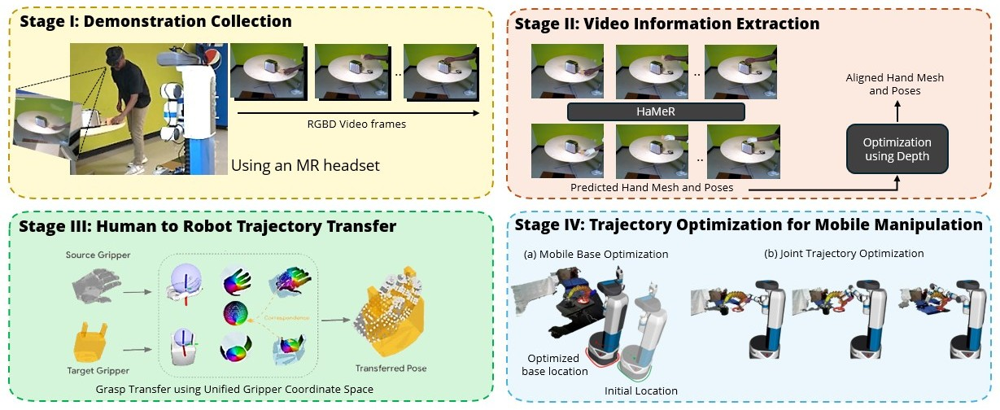

<h1 align="center" style="font-size: 1.8em; font-weight: bold;">
  HRT1: One-Shot Human-to-Robot Trajectory Transfer for Mobile Manipulation
</h1>

<p align="center">
  <a href="https://saihaneeshallu.github.io/">Sai Haneesh Allu</a>, 
  <a href="https://jishnujayakumar.github.io/">Jishnu Jaykumar P</a>, 
  <a href="https://kninad.github.io/">Ninad Khargonkar</a>, 
  <a href="https://personal.utdallas.edu/~tyler.summers/">Tyler Summers</a>, 
  <a href="https://scholar.google.com/citations?user=V3kGMXUAAAAJ&hl=en>Jian Yao">Jian Yao</a>, 
  <a href="https://yuxng.github.io">Yu Xiang</a>
</p>

<div align="center"">

[arXiv](https://arxiv.org/abs/2510.21026)  **|** [Project WebPage](https://irvlutd.github.io/HRT1/) 

</div>

<div align="justify">
We introduce a novel system for human-to-robot trajectory transfer that enables robots to manipulate objects by learning from human demonstration videos. The system consists of four modules. The first module is a data collection module that is designed to collect human demonstration videos from the point of view of a robot using an AR headset. The second module is a video understanding module that detects objects and extracts 3D human-hand trajectories from demonstration videos. The third module transfers a human-hand trajectory into a reference trajectory of a robot end-effector in 3D space. The last module utilizes a trajectory optimization algorithm to solve a trajectory in the robot configuration space that can follow the end-effector trajectory transferred from the human demonstration. Consequently, these modules enable a robot to watch a human demonstration video once and then repeat the same mobile manipulation task in different environments, even when objects are placed differently from the demonstrations.
</div>
<br></br>

<p align="center">
  
</p>

<br></br>
## Citation
Please cite this work if it helps in your research
```
@misc{2025hrt1,
  title={HRT1: One-Shot Human-to-Robot Trajectory Transfer for Mobile Manipulation}, 
  author={Sai Haneesh Allu* and Jishnu Jaykumar P* and Ninad Khargonkar and Tyler Summers and Jian Yao and Yu Xiang},
  year={2025},
  url={https://arxiv.org/abs/2510.21026}, 
}
```


## ⚙️ Setup

### Clone the Repository and set environment variables
Clone the repository recursively to include all submodules:
```bash
git clone --recursive https://github.com/IRVLUTD/HRT1 && cd HRT1
# Create a conda environment from scratch
conda create -n hrt1 python=3.10  # Python 3.10 required for samv2 and hamer dependencies
conda activate hrt1

# Set your CUDA_HOME environment variable
export CUDA_HOME=/usr/local/cuda
```
This codebase, built on top of the [robokit](https://github.com/IRVLUTD/robokit) and [gto](https://github.com/IRVLUTD/GraspTrajOpt) tools. Refer Readme document for each of the below utilities to setup the pipeline. 

- Stage I: [`dc/`](dc/) contains the HoloLens app for data capture.
- Stage II & III: [`vie/`](vie/) contains human demo data capture and video information extraction (vie) modules and grasp transfer.
  -  **Note**: This also contains BundleSDF module to run object pose estimation during execution.
- Stage IV: [`tto/`](tto/) contains the instructions for simulation , realworld setup and runtime scripts for trajectory tracking optimization and task execution.

 To get the latest changes from the submodules
```shell
git submodule sync
git submodule update --remote --recursive
```


