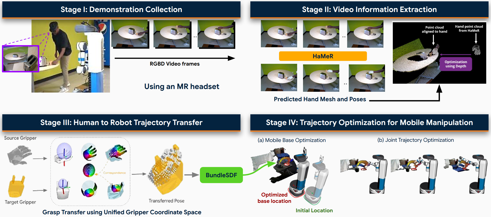
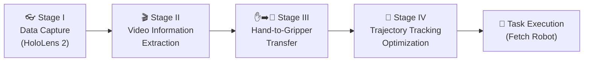

<h1 align="center">
  🤖 HRT1: One-Shot Human-to-Robot Trajectory Transfer for Mobile Manipulation
</h1>

<p align="center">
  <a href="https://saihaneeshallu.github.io/">Sai Haneesh Allu*</a> ·
  <a href="https://jishnujayakumar.github.io/">Jishnu Jaykumar P*</a> ·
  <a href="https://kninad.github.io/">Ninad Khargonkar</a> ·
  <a href="https://personal.utdallas.edu/~tyler.summers/">Tyler Summers</a> ·
  <a href="https://scholar.google.com/citations?user=V3kGMXUAAAAJ&hl=en">Jian Yao</a> ·
  <a href="https://yuxng.github.io">Yu Xiang</a>
  <br>
  <sub>* Equal Contribution</sub>
</p>

<p align="center">
  <a href="https://arxiv.org/abs/2510.21026"></a>
  <a href="https://irvlutd.github.io/HRT1/"></a>
  <a href="LICENSE"></a>
  
  
  
</p>

<p align="center">
  
</p>

> **TL;DR** — A robot watches a human demonstration **once** (captured from the robot's point of view through an AR headset) and then repeats the same mobile manipulation task in new environments, even when objects are placed differently.

---

## 📑 Table of Contents

- [📝 Abstract](#-abstract)
- [🧩 Pipeline at a Glance](#-pipeline-at-a-glance)
- [⚙️ Setup](#️-setup)
- [🔄 Updating Submodules](#-updating-submodules)
- [🙏 Acknowledgements](#-acknowledgements)
- [📚 Citation](#-citation)

---

## 📝 Abstract

<div align="justify">
We introduce a novel system for human-to-robot trajectory transfer that enables robots to manipulate objects by learning from human demonstration videos. The system consists of four modules. The first module is a data collection module that is designed to collect human demonstration videos from the point of view of a robot using an AR headset. The second module is a video understanding module that detects objects and extracts 3D human-hand trajectories from demonstration videos. The third module transfers a human-hand trajectory into a reference trajectory of a robot end-effector in 3D space. The last module utilizes a trajectory optimization algorithm to solve a trajectory in the robot configuration space that can follow the end-effector trajectory transferred from the human demonstration. Consequently, these modules enable a robot to watch a human demonstration video once and then repeat the same mobile manipulation task in different environments, even when objects are placed differently from the demonstrations.
</div>

---

## 🧩 Pipeline at a Glance

| Stage | Module | What it does | Docs |
| :---: | :--- | :--- | :---: |
| **I** | 👓 **Data Capture** | HoloLens 2 app + robot-side ROS endpoint to record human demos from the robot's viewpoint | [`dc/`](dc/README.md) |
| **II** | 🎬 **Video Information Extraction (VIE)** | Object detection & tracking (GroundingDINO + SAM 2) and 3D hand-trajectory extraction (HaMeR) | [`vie/`](vie/README.md) |
| **III** | ✋➡️🦾 **Grasp Transfer** | Maps human-hand poses to Fetch gripper poses; BundleSDF for object pose estimation at execution time | [`vie/`](vie/README.md) |
| **IV** | 🚀 **Trajectory Tracking Optimization (TTO)** | Solves for robot joint trajectories that follow the transferred end-effector path — in simulation and the real world | [`tto/`](tto/README.md) |


```mermaid
flowchart LR
    A["👓 Stage I<br/>Data Capture<br/>(HoloLens 2)"] --> B["🎬 Stage II<br/>Video Information<br/>Extraction"]
    B --> C["✋➡️🦾 Stage III<br/>Hand-to-Gripper<br/>Transfer"]
    C --> D["🚀 Stage IV<br/>Trajectory Tracking<br/>Optimization"]
    D --> E["🤖 Task Execution<br/>(Fetch Robot)"]
```

---

## ⚙️ Setup

### Clone the Repository and set environment variables
Clone the repository recursively to include all submodules:
```bash
git clone --recursive https://github.com/IRVLUTD/HRT1 && cd HRT1
# Create a conda environment from scratch
conda create -n hrt1 python=3.10  # Python 3.10 required for samv2 and hamer dependencies
conda activate hrt1

# Set your CUDA_HOME environment variable
export CUDA_HOME=/usr/local/cuda
```
This codebase, built on top of the [robokit](https://github.com/IRVLUTD/robokit) and [gto](https://github.com/IRVLUTD/GraspTrajOpt) tools. Refer Readme document for each of the below utilities to setup the pipeline. 

- Stage I: [`dc/`](dc/) contains the HoloLens app for data capture.
- Stage II & III: [`vie/`](vie/) contains human demo data capture and video information extraction (vie) modules and grasp transfer.
  -  **Note**: This also contains BundleSDF module to run object pose estimation during execution.
- Stage IV: [`tto/`](tto/) contains the instructions for simulation , realworld setup and runtime scripts for trajectory tracking optimization and task execution.

---

## 🔄 Updating Submodules

 To get the latest changes from the submodules

```shell
git submodule sync
git submodule update --remote --recursive
```

---

## 🙏 Acknowledgements

HRT1 builds on several excellent open-source projects, including
[GroundingDINO](https://github.com/IDEA-Research/GroundingDINO),
[SAM 2](https://github.com/facebookresearch/sam2),
[HaMeR](https://github.com/geopavlakos/hamer),
[BundleSDF](https://github.com/NVlabs/BundleSDF), and
[ROS-TCP-Endpoint](https://github.com/Unity-Technologies/ROS-TCP-Endpoint).
We thank their authors for making their work available.

---

## 📚 Citation

Please cite this work if it helps in your research
```bibtex
@misc{2025hrt1,
  title={HRT1: One-Shot Human-to-Robot Trajectory Transfer for Mobile Manipulation}, 
  author={Sai Haneesh Allu* and Jishnu Jaykumar P* and Ninad Khargonkar and Tyler Summers and Jian Yao and Yu Xiang},
  year={2025},
  url={https://arxiv.org/abs/2510.21026}, 
}
```

---

<p align="center">
  Released under the <a href="LICENSE">MIT License</a>
</p>
