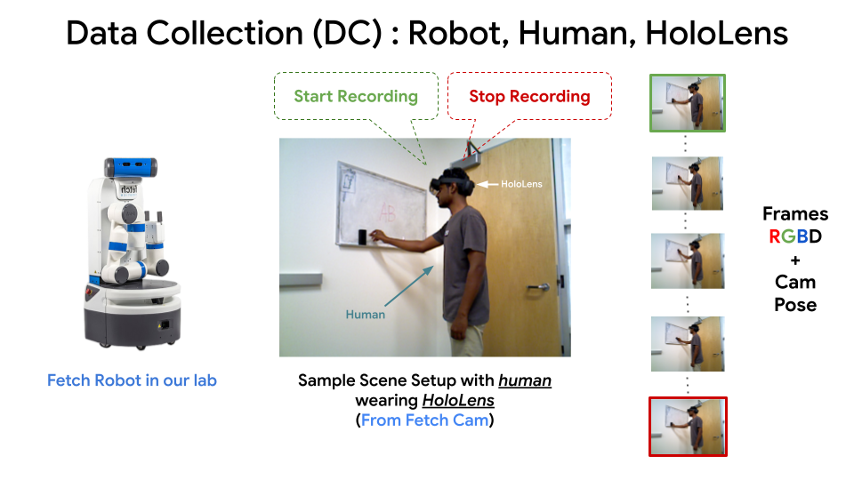

### HoloLens 2 Application for Data Collection

**To-Do:**
- Include an image or video showcasing the data capture setup.



### 1. Data Capture
```shell
# start running the data capture ros node
python save_data.py <task-name> <data-interval>
```

### After data capture following would be the data dir structure
```
├── data_captured
    ├── <task-name>-1/
        ├── rgb/
            ├── 000000.jpg
            ├── 000001.jpg
            └── ...
        ├── depth/
            ├── 000000.png
            ├── 000001.png
            └── ...
        └── pose/
            ├── 000000.npz
            ├── 000001.npz
            └── ...
    ├── <task-name>-2/
    ├── <task-name>-.../
```
