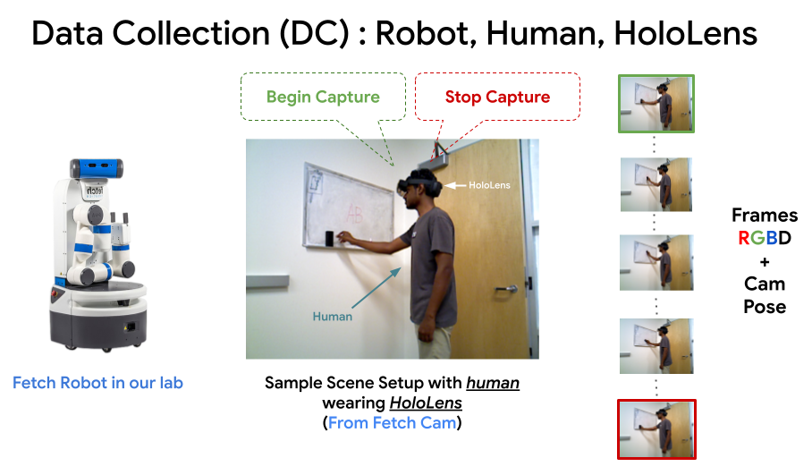
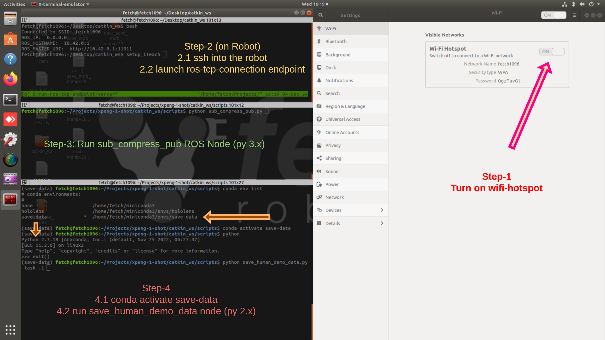

# 🛠️ Hardware Setup for Data Collection



---

## 1️⃣ Setup Robot 🤖

🚀 Set up [ROS-TCP-Endpoint](https://github.com/Unity-Technologies/ROS-TCP-Endpoint) on the robot:

```bash
source /opt/ros/$ROS_DISTRO/setup.bash
ROOT_DIR=$PWD
cd robot/catkin_ws
rm -rf build/ devel/
catkin_make
source devel/setup.bash
cd $ROOT_DIR
```



### Steps:
- 1️⃣ **Activate robot WiFi hotspot** from network settings. 📶  
- 2️⃣ **Launch ros_tcp_endpoint.** 🔗  
- 3️⃣ **Run subscribe, compress, and publish script:** 📡  
    - Ensures real-time streaming.
    - Requires Python 3.x. Example conda [env.yml](./robot/catkin_ws/conda-env/robot-hololens.yml).  
- 4️⃣ **Run save human demo data script:** 💾  
    - Requires Python 2.x. Example conda [env.yml](./robot/catkin_ws/conda-env/robot-save-data.yml).
---

## 2️⃣ Setup HoloLens2 👓

### Steps:
- 1️⃣ **Connect to Robot WiFi hotspot.** [📹 Video](../media/hololens/wifi-conn-setup-hololens.mp4)  
- 2️⃣ **Download and install the app on HoloLens2:**  
   - [⬇️ Download app.msix](https://utdallas.box.com/v/iTeachSkills-DataCapture-App).  
   - Follow [installation guide 🎥](https://www.youtube.com/watch?v=7xFtCPSMTEk).  
   - *Note:* The app source code is available [here](https://utdallas.box.com/v/iTeachSkills-DataCapture-Code).  
- 3️⃣ (🔜 TODO) A demo video showing user interaction with the app for data collection. (*Hosted on Box due to large size*).  

---

## 📂 Data Directory Structure After Capture

After data capture, the directory structure will look like this:

```
├── data_captured
    ├── <task-name>-1/
        ├── cam_K.txt
        ├── rgb/
            ├── 000000.jpg
            ├── 000001.jpg
            └── ...
        ├── depth/
            ├── 000000.png
            ├── 000001.png
            └── ...
        └── pose/
            ├── 000000.npz
            ├── 000001.npz
            └── ...
    ├── <task-name>-2/
    ├── <task-name>-.../
```

---

🎉 **You're ready to capture data!**
