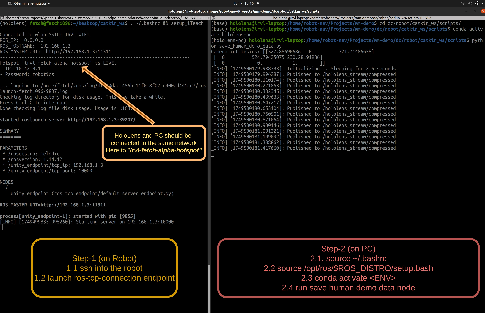

<p align="right"><a href="../README.md">⬅️ Back to HRT1</a></p>

# 🛠️ Hardware Setup for Data Collection

[](../README.md#-pipeline-at-a-glance)
[](https://www.ros.org/)
[](https://www.microsoft.com/en-us/hololens)
[](https://github.com/Unity-Technologies/ROS-TCP-Endpoint)

- [🛠️ Hardware Setup for Data Collection](#️-hardware-setup-for-data-collection)
  - [1️⃣ Setup Robot 🤖](#1️⃣-setup-robot-)
    - [Steps:](#steps)
  - [2️⃣ Setup HoloLens2 👓](#2️⃣-setup-hololens2-)
    - [Steps:](#steps-1)
  - [📂 Data Directory Structure After Capture](#-data-directory-structure-after-capture)

---

## 1️⃣ Setup Robot 🤖

🚀 Set up [ROS-TCP-Endpoint](https://github.com/Unity-Technologies/ROS-TCP-Endpoint) on the robot:

```bash
source /opt/ros/$ROS_DISTRO/setup.bash
ROOT_DIR=$PWD
cd robot/catkin_ws
rm -rf build/ devel/
catkin_make
source devel/setup.bash
cd $ROOT_DIR
```

<p align="center">
  
</p>

### Steps:
- 1️⃣ **Activate robot WiFi hotspot** from network settings. 📶  
- 2️⃣ **Launch ros_tcp_endpoint.** 🔗  
- 3️⃣ **Run subscribe, compress, and publish script:** 📡  
    - Ensures real-time streaming.
    - Requires Python 3.x. Example conda [env.yml](./robot/catkin_ws/conda-env/robot-hololens.yml).  
- 4️⃣ **Run save human demo data script:** 💾  
    - Requires Python 2.x. Example conda [env.yml](./robot/catkin_ws/conda-env/robot-save-data.yml).

---

## 2️⃣ Setup HoloLens2 👓

### Steps:
- 1️⃣ **Connect to Robot WiFi hotspot.** [📹 Video](../media/hololens/wifi-conn-setup-hololens.mp4)  
- 2️⃣ **Download and install the app on HoloLens2:**  
   - [⬇️ Download app.msix](https://utdallas.box.com/v/iTeachUOIS-App).  
   - Follow [sample installation guide 🎥](https://www.youtube.com/watch?v=7xFtCPSMTEk).  
   - *Note:* The app source code is available [here](https://github.com/IRVLUTD/iTeachSkillsApp).  
- 3️⃣ A [sample demo video](https://utdallas.box.com/v/iTeach-Data-Capture-App-Demo) showing user interaction with the app for data collection.

---

<p align="center">🎉 <b>You're ready to capture data!</b></p>

---

## 📂 Data Directory Structure After Capture
The data will stored in `dc/robot/catkin_ws/scripts/data_captured/`
After data capture, the directory structure will look like this:

```text
├── data_captured
    ├── <task-name>_1/
        ├── cam_K.txt
        ├── rgb/
            ├── 000000.jpg
            ├── 000001.jpg
            └── ...
        ├── depth/
            ├── 000000.png
            ├── 000001.png
            └── ...
        └── pose/
            ├── 000000.npz
            ├── 000001.npz
            └── ...
    ├── <task-name>_2/
    ├── <task-name>_.../
```
