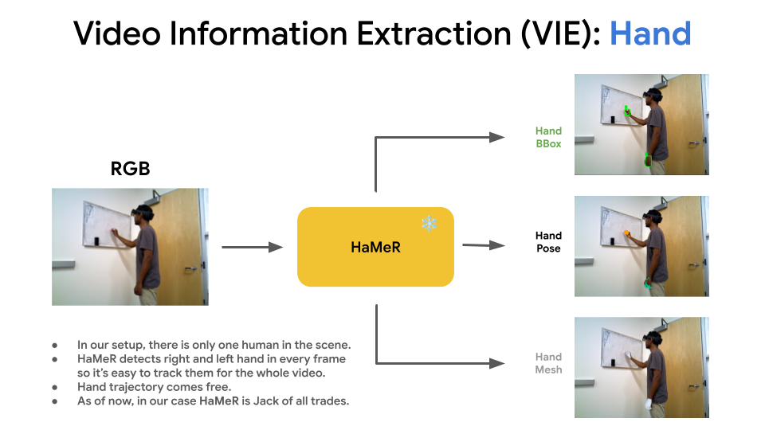

# 📁 VIE Setup and Usage Guide

- [📁 VIE Setup and Usage Guide](#-vie-setup-and-usage-guide)
  - [🛠️ Setup Instructions](#️-setup-instructions)
    - [🧑‍💻 Run the Setup Script](#-run-the-setup-script)
  - [📜 Requirements](#-requirements)
  - [⚙️ Data preprocessing](#️-data-preprocessing)
    - [1. Setup paths](#1-setup-paths)
  - [🔧 Tools](#-tools)
    - [2. 🔍 Find object prompts using GDINO](#2--find-object-prompts-using-gdino)
    - [3. 🤖 Generate object masks using GDINO + SAMv2](#3--generate-object-masks-using-gdino--samv2)
    - [4. ✋ Extracting Right/Left Hand BBoxes and 3D Meshes (HaMeR)](#4--extracting-rightleft-hand-bboxes-and-3d-meshes-hamer)
    - [5. Transfer Human Hand to Fetch Gripper](#5-transfer-human-hand-to-fetch-gripper)
    - [🧩 To visualize scene, hamer hand pose \& transferred pose](#-to-visualize-scene-hamer-hand-pose--transferred-pose)
    - [🔧 Arguments](#-arguments)
    - [6. BundleSDF Docker Setup](#6-bundlesdf-docker-setup)
    - [7. Object Pose Estimation Using BundleSDF](#7-object-pose-estimation-using-bundlesdf)
  - [8. Run GSAM2 + BundleSDF for Real-World Object Pose Estimation](#8-run-gsam2--bundlesdf-for-real-world-object-pose-estimation)
    - [👉 Object Pose Estimation with Multi-Frame Context:](#-object-pose-estimation-with-multi-frame-context)
  - [🗂️ Output Directory Structure After Data Processing](#️-output-directory-structure-after-data-processing)
    - [🗂️ obj\_prompt\_mapper.json](#️-obj_prompt_mapperjson)
  - [🙏 Acknowledgments](#-acknowledgments)


## 🛠️ Setup Instructions

To set up the environment and prepare the vie pipeline, run the following commands:

### 🧑‍💻 Run the Setup Script
```shell
# Remove all __pycache__ directories and .egg-info files recursively
find . -name "__pycache__" -type d -exec rm -rf {} + -o -name "*.egg-info" -type d -exec rm -rf {} +

# Make the setup script executable and run it
chmod +x ./setup_vie.sh
./setup_vie.sh
```

## 📜 Requirements

- Following modules are tested on **Python 3.10.15**
  - `robokit` (gdino+samv2). Example conda [env.yml](./conda-envs/gsam2-py3.10.yml).
  - `hamer` & `rfp-grasp-transfer`. Example conda [env.yml](./conda-envs/robokit-py3.10.yml).

- BundleSDF runs in [docker](BundleSDF/docker) with **Python 3.8**

https://github.com/user-attachments/assets/015088f9-7031-44b9-b1b4-f4ea75043109


## ⚙️ Data preprocessing

### 1. Setup paths
```shell
export PROJECT_ROOT=/path/to/hrt1
export VIE_ROOT=$PROJECT_ROOT/vie
export TASK_DATA_ROOT=/path/to/data/captured/task_x
```

## 🔧 Tools

📌 Step Dependencies Overview:
- 🔁 Step 2 ➡️ Step 3:
    - Object prompt selection (GDINO) is required before generating masks.
- 🔁 Step 3 ➡️ Step 7 & 8:
    - Object masks from Step 3 are used in BundleSDF for pose estimation.
- 🔓 Step 4:
    - Hand mesh extraction (HaMeR) can be performed independently.
- 🔁 Step 3 ➡️ Step 5:
    - Gripper transfer needs the hand mesh aligned with object masks.
- 🚀 Step 8:
    - Full real-world execution combining all outputs (masks, poses).
- 🐳 Docker Dependency (Steps 7 & 8)
  - These steps must be executed inside a Docker container.
  - Check Step 6 to start and enter docker.

<hr>

### 2. 🔍 Find object prompts using GDINO
Use GDINO with a text prompt to identify the object of interest in the first frame:
```shell
cd $VIE_ROOT
python test_gdino_prompts.py \
    --input_dir $TASK_DATA_ROOT/rgb \
    --text_prompt <obj-text-prompt> \
    --infer_first_only

# Output will be saved at:
# $TASK_DATA_ROOT/out/gdino/<obj_text_prompt>
# Note: spaces in <obj-text-prompt> will be replaced with "_"
```
✅ Once you've found a text prompt that successfully detects the object, use it in Step 3 to generate object masks across all frames.

<hr>


### 3. 🤖 Generate object masks using GDINO + SAMv2
To use GDINO and SAMv2 for object bounding box detection and tracking in video frames:
```shell
cd $VIE_ROOT
python run_gdino_samv2.py --input_dir $TASK_DATA_ROOT/rgb --text_prompt <obj-text-prompt> --save_interval=1
# Output saved in:
# $TASK_DATA_ROOT/out/samv2/<obj_text_prompt>/obj_masks - object mask
# $TASK_DATA_ROOT/out/samv2/<obj_text_prompt>/masks_traj_overlayed - Trajectory + mask overlay + initial object bbox
```

<hr>

### 4. ✋ Extracting Right/Left Hand BBoxes and 3D Meshes (HaMeR)


This step extracts right(1) / left(0) hand bounding boxes and 3D hand meshes using HaMeR.

✅ Assumptions:
- Only one person is present in the scene.
- Only frames containing at least one visible hand will be processed and saved under `out/hamer/model`.
```shell
cd $VIE_ROOT/hamer
python extract_hand_bboxes_and_meshes.py --opt_weight 100.0 --input_dir $TASK_DATA_ROOT/rgb
```

📤 Output Directory Structure:
- `$TASK_DATA_ROOT/out/hamer/extra_plots` – Visualizations and debugging images
- `$TASK_DATA_ROOT/out/hamer/scene` – RGB scene point cloud
- `$TASK_DATA_ROOT/out/hamer/model` – HaMeR results including MANO parameters
- `$TASK_DATA_ROOT/out/hamer/3dhand` – Aligned 3D hand meshes

🛠️ Known Issue (Python 3.10+)
If you encounter:
```shell
from collections import Mapping
ImportError: cannot import name 'Mapping' from 'collections'
```
✅ Try this fix: `pip install --upgrade networkx`

<hr>

### 5. Transfer Human Hand to Fetch Gripper

This step requires the human hand mesh output from Step 4 (HaMeR). It maps the human hand configuration to the target robot gripper (e.g., Fetch gripper).

```shell
# Navigate to the repo and initialize submodules
cd $VIE_ROOT/rfp-grasp-transfer
git submodule update --init --recursive

# Run the hand-to-gripper transfer script
python transfer_from_hamer.py \
--mano_model_dir ../hamer/_DATA/data/mano/mano_v1_2/models/ \
--target_gripper fetch_gripper \
--debug_plots \
--input_dir $TASK_DATA_ROOT
```

📤 Output Directory Structure:
- `$TASK_DATA_ROOT/out/hamer/transfer_extra_plots` – Visualizations and debugging plots
- `$TASK_DATA_ROOT/out/hamer/transfer_hand_mesh` – Transfered 3D fetch gripper meshes

🛠️ Troubleshooting
If you see this error:
```
from collections import Mapping
ImportError: cannot import name 'Mapping' from 'collections'
```
✅ Try this fix: `pip install --upgrade networkx`

---

### 🧩 To visualize scene, hamer hand pose & transferred pose
This script visualizes the combined 3D point clouds from:
- `hamer/scene/` — RGB scene point cloud
- `hamer/3dhand/` — Predicted human hand mesh
- `hamer/transfer_hand_mesh/` — Transferred gripper mesh

```shell
python ply_viewer_with_combined_ply.py \
--data_dir $DATA_ROOT \
--num_points 100000000 \
--auto_mode \
--fps 10
```

### 🔧 Arguments

| Argument             | Type    | Default                    | Description                                                                 |
|----------------------|---------|----------------------------|-----------------------------------------------------------------------------|
| `--data_dir`         | `str`   | `./data/ply_sequence/`     | Base directory containing `scene`, `3dhand`, and `transfer_hand_mesh` dirs |
| `--num_points`       | `int`   | `10000000000`              | Max number of points to load from each PLY file                             |
| `--fps`              | `int`   | `5`                        | Frames per second in auto playback mode                                     |
| `--skip_viz_frames`  | `int`   | `1`                        | Show every Nth frame in auto/manual mode                                    |
| `--auto_mode`        | `flag`  | `False`                    | Auto-play the sequence in a loop                                            |
| `--left_hand`        | `flag`  | `False`                    | Load left-hand meshes (`*_0.ply`); right-hand (`*_1.ply`) by default        |


<hr>

### 6. BundleSDF Docker Setup 
BundleSDF runs in docker. First setup docker container and enter
```shell
cd $VIE_ROOT/BundleSDF/
./docker/start_docker.sh # start docker container
./docker/enter_docker.sh $PWD # enter docker container
```

### 7. Object Pose Estimation Using BundleSDF
Run object pose estimation on captured video frames using BundleSDF (in docker):
```shell
cd $VIE_ROOT/BundleSDF/
python run_pose_only_bsdf.py --mode run_video --video_dir $TASK_DATA_ROOT
```

🛠️ Troubleshooting
If you encounter the following error:
```shell
from ._ckdtree import cKDTree, cKDTreeNode
ImportError: /usr/lib/x86_64-linux-gnu/libstdc++.so.6: version `GLIBCXX_3.4.29' not found (required by /opt/conda/envs/py38/lib/python3.8/site-packages/scipy/spatial/_ckdtree.cpython-38-x86_64-linux-gnu.so)
```
✅ Try this fix: `pip install --upgrade scipy==1.10 yacs`

💡 Heuristic Tip:
- If the predicted pose lies entirely within the object mask, it can be considered valid.
- If not, the frame can be skipped—this simple heuristic helps filter out incorrect poses efficiently.

<hr>


## 8. Run GSAM2 + BundleSDF for Real-World Object Pose Estimation
Use the following command to perform real-time object pose estimation (in docker) by combining source frames (human demo) with rollout frames (robot execution):
```shell
cd $VIE_ROOT
./run_bundlesdf.sh $TASK_DATA_ROOT <src-frames> <rollout-frames>
# Example:
# ./run_obj_pose_est.sh "./vie/_DATA/new-data-from-fetch-and-laptop/22tasks.latest/task_8_17s-use_hammer/" 15 5
```
🧩 Arguments:
- `task-root-dir-path`: Task root dir path
- `src-frames`: Number of frames to extract from the human demonstration.
- `rollout-frames`: Number of frames to process during real-time rollout.

### 👉 Object Pose Estimation with Multi-Frame Context:
- 📸 Uses multiple frames from both:
  - Source phase (human demonstration)
  - Rollout phase (real-time robot execution)
- 🎯 Provides richer visual and temporal context for improved understanding
- 🚀 Significantly outperforms single-frame methods in Accuracy, Stability, Robustness
- ✅ Enables more reliable pose tracking across time during real-world execution

<hr>

## 🗂️ Output Directory Structure After Data Processing
```
data_captured/
├── task_1/
│   ├── cam_K.txt                      # Camera intrinsics
│   ├── rgb/                           # RGB frames
│   │   ├── 000000.jpg
│   │   ├── 000001.jpg
│   │   └── ...
│   ├── depth/                         # Aligned depth frames (in mm)
│   │   ├── 000000.png
│   │   ├── 000001.png
│   │   └── ...
│   ├── pose/                          # RT camera (npz)
│   │   ├── 000000.npz
│   │   ├── 000001.npz
│   │   └── ...
│   └── out/                           # All derived outputs
│       ├── gdino/
│       │   └── <text-prompt>/         # GDINO raw detection outputs
│       ├── samv2/
│       │   ├── <text-prompt>/             # Processed masks from GDINO + SAMv2
    │       │   ├── obj_masks/             # Binary masks per object
    │       │   └── masks_traj_overlayed/  # RGB overlays with tracked masks
│       ├── bundlesdf/
│       │   ├── demonstration/
│       │   │   └── obj_<1/2>/
│       │   │       ├── ob_in_cam/             # Object point clouds
│       │   │       ├── pose_overlayed_rgb/    # Pose visualizations
│       │   │       └── obj_prompt_mapper.json # Maps object index to prompt
│       │   └── rollout/
│       │       └── obj_<1/2>/                 # Same as demo but for execution
│       │           ├── ob_in_cam/
│       │           ├── pose_overlayed_rgb/
│       │           └── obj_prompt_mapper.json
│       └── hamer/
│           ├── extra_plots/          # Debug plots (optional)
│           │   ├── 000000.npz
│           │   └── ...
│           ├── scene/                # Full scene point clouds
│           │   ├── 000000.ply
│           │   └── ...
│           ├── model/                # MANO hand model outputs
│           │   ├── 000000.npz
│           │   └── ...
│           └── 3dhand/               # 3D hand meshes aligned to scene
│               ├── 000000.ply
│               └── ...
├── task_2/
└── task_.../
```


### 🗂️ obj_prompt_mapper.json
- Maps object identifiers (e.g., obj_1, obj_2) to their corresponding text prompts used during SAMv2 mask generation.
- Ensures a consistent mapping between:
  - Source: `$TASK_DATA_ROOT/out/sam2/<text_prompt>/obj_masks`
  - Target: `$TASK_DATA_ROOT/masks/`
- This linkage is critical for enabling accurate object pose estimation during real-time execution.

🔗 Example for single object:
```json
{
  "obj_1": "black_eraser"
}
```

🔗 Example for dual objects:
```json
{
  "obj_1": "black_eraser",
  "obj_2": "whiteboard"
}
```


## 🙏 Acknowledgments

This project utilizes the following resources:
- [GDINO + SamV2](https://github.com/jishnujayakumar/robokit)
- [HaMeR](https://github.com/IRVLUTD/HaMeR)
- [rfp-grasp-transfer](https://github.com/IRVLUTD/rfp-grasp-transfer)
- [BundleSDF](https://github.com/jishnujayakumar/BundleSDF)
